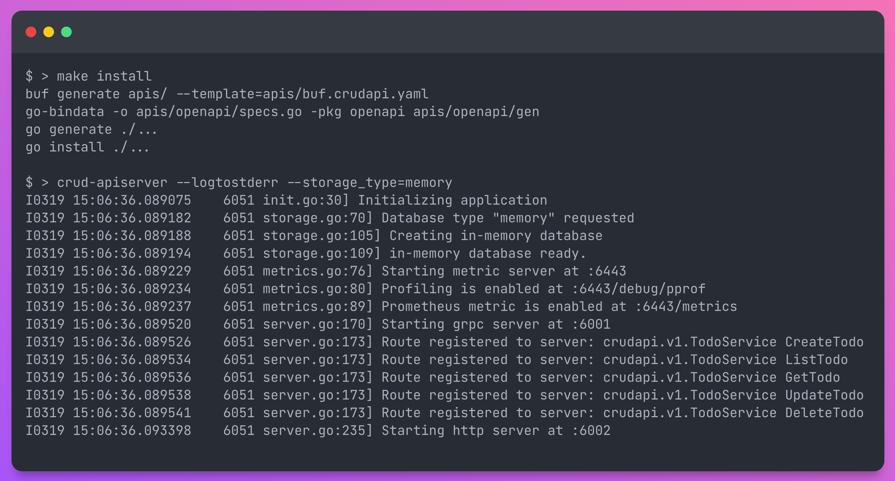
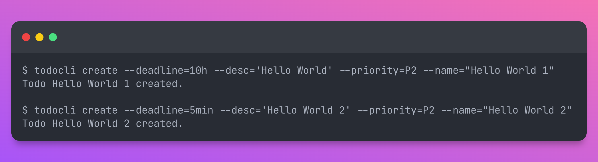
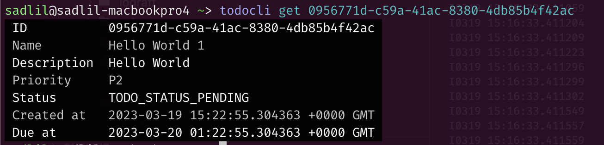
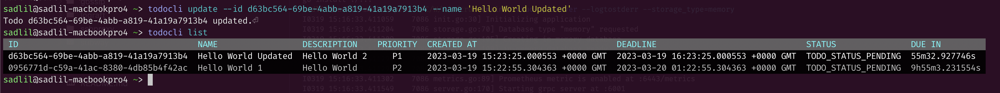
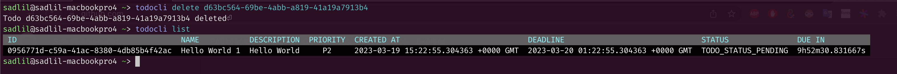
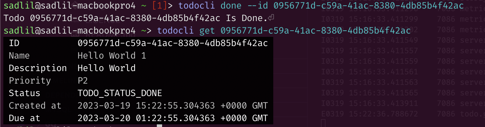

# Application Demo

1. Compile, install and Run the application using `make install` and `crud-apiserver --logtostderr --storage_type=memory`. This will run the crud-apiserver binary with memory as storage backend.
<br><br>


2. Checkout the Helathz, Statusz, Metrics and Debug URLs for the server binary in -
    - <http://localhost:6443/healthz>
    - <http://localhost:6443/statusz>
    - <http://localhost:6443/metrics>
    - <http://localhost:6443/debug/pprof/>

3. Checkout the Generated Swagger Specs for the APIs in <http://localhost:6002/swagger/crudapi.swagger.json>

4. Run `todocli --help` to checkout the todocli configs

    ```shell
    $ todocli --help
    Usage:
    todocli [flags]
    todocli [command]

    Examples:
    todocli get <id>

    Available Commands:
    completion  Generate the autocompletion script for the specified shell
    create
    delete
    done
    get
    help        Help about any command
    list
    update

    Flags:
    -a, --addr string                      Server address (default "http://localhost:6002")
        --alsologtostderr                  log to standard error as well as files
    -h, --help
        --log_backtrace_at traceLocation   when logging hits line file:N, emit a stack trace (default :0)
        --log_dir string                   If non-empty, write log files in this directory
        --logtostderr                      log to standard error instead of files
        --stderrthreshold severity         logs at or above this threshold go to stderr (default 3)
    -t, --transport string                 Transport to use for the coneection to server, http or grpc (default "http")
    -v, --v Level                          log level for V logs
        --vmodule moduleSpec               comma-separated list of pattern=N settings for file-filtered logging

    Use "todocli [command] --help" for more information about a command.
    ```

5. Create any todo using `todocli create --deadline=1h --desc='Hello World 1' --priority=P2 --name="Hello World 1`.
<br><br>


6. Read the details of todo by `todocli get uuid`.
<br><br>


7. List all todos using `todocli list`.
<br><br>


8. Update todo using `todocli update --id uuid --name 'Hello World Updated'`.
<br><br>


9. Delete Todo using `todocli delete uuid`.
<br><br>


10. Mark todo as done `todocli done --id uuid`.
<br><br>

