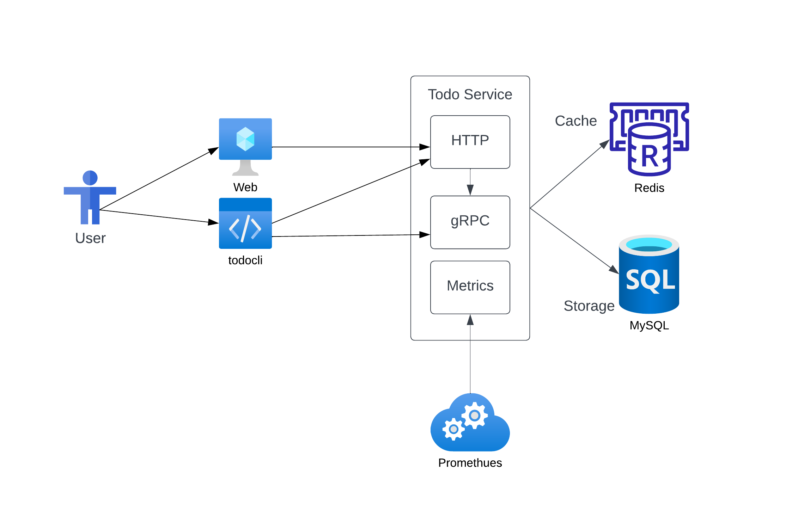

# Todo Service Design

Author: sadlil@<br/>
Last Update: 21 Feb 2023<br/>
Status: Work In Progress<br/>
Note: This is also a **tin-can** design just to demonstrate a design process.<br/>

## Objective

The objective of this docuemnt is to design a Todo Service to provide users with a reliable and efficient way to manage their tasks. The service should be easy to use for the users and provide both gRPC and HTTP endpoints for client communication. The service should use Protobuf format for its APIs and implement a microservices architecture with separate services for handling requests and managing data. The service should use MySQL as its primary database and Redis for caching to provide fast and efficient access to task data. The service should be deployed using a Docker container on a Kubernetes cluster to ensure high availability and scalability.

## Requirements

- The Todo Service shall provide CRUD functionality for tasks, including the ability to create, list, get, update, and delete tasks.
- The service should provide first class support for application monitoring.
- The Todo Service shall include proper error handling and logging to ensure reliability and maintainability. The service shall have an uptime of 99.9%.
- The Todo Service shall be able to handle concurrent requests and perform well under high load, with a maximum response time of 500ms for any request.

### Non Goals

- User Management and Auth Support for this iteration.
- Development of any UI portal.

## Design



Todo service will be designed as a single rpc service and as a single binary for ease of development and deployment. The service should support
both grpc and http protocol.

### Service

#### API

The service APIs will be defined in protobuf, and can be used to generate code in multiple languages. The service will
use the generated golang codes for server and client implementations.

```proto
service TodoService {
  // CreateTodo RPC creates a new Todo object.
  rpc CreateTodo(CreateTodoRequest) returns (CreateTodoResponse) {
    option (google.api.http) = {
      post: "/api/v1/todo"
      body: "*"
    };
  }

  // ListTodo RPC retrieves a list of Todo objects.
  rpc ListTodo(ListTodoRequest) returns (ListTodoResponse) {
    option (google.api.http) = {
      get: "/api/v1/todo"
    };
  }

  // GetTodo RPC retrieves a single Todo object based on its ID.
  rpc GetTodo(GetTodoRequest) returns (GetTodoResponse) {
    option (google.api.http) = {
      get: "/api/v1/todo/{id}"
    };
  }

  // UpdateTodo RPC updates an existing Todo object.
  rpc UpdateTodo(UpdateTodoRequest) returns (UpdateTodoResponse) {
    option (google.api.http) = {
      put: "/api/v1/todo/{id}"
      body: "*"
    };
  }

  // The DeleteTodo RPC deletes a Todo object based on its ID.
  rpc DeleteTodo(DeleteTodoRequest) returns (google.protobuf.Empty) {
    option (google.api.http) = {
      delete: "/api/v1/todo/{id}"
    };
  }
}
```

### Data

Service should be able to use mysql for production and memory storage support for testing purposes. The storgare should be
pluggable and can be changed at runtime.

### Caching strategy

Service implements a layer of caching before accessing reading the database. The cache can be plugablge and multiple layer as well.
Production cache should depende on Redis cluster.
